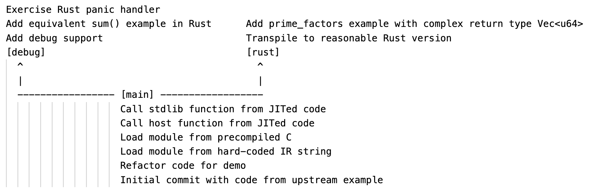

# Zero to Rust-JIT with the LLVM C-API

Let's talk about the LLVM C-API, OrcJIT and Rust!

## Agenda




## (1) Initial commit with code from upstream example

* Upstream C-API examples for LLVM OrcJIT: https://github.com/llvm/llvm-project/tree/main/llvm/examples/OrcV2Examples
* Upstream C-API unittests: https://github.com/llvm/llvm-project/blob/main/llvm/unittests/ExecutionEngine/Orc/OrcCAPITest.cpp
* C-API pros/cons:
  * API quite stable compared to C++
  * C ABI is stable
  * Straightforward to use, but C can be cumbersome
  * Only subset of features

Setup:
```
➜ git clone https://github.com/echtzeit-dev/zero-to-rust-jit
➜ git checkout -q 3fac86a
➜ cmake -GNinja -Bbuild -S. -DCMAKE_BUILD_TYPE=Debug -DCMAKE_EXPORT_COMPILE_COMMANDS=On -DLLVM_DIR=/usr/local/opt/llvm@17/lib/cmake/llvm
➜ ninja -C build
➜ ./build/zero-to-rust-jit
1 + 2 = 3
```


## (2) Refactor code for demo

```
➜ git checkout -q 02c06ab
➜ ninja -C build
➜ ./build/zero-to-rust-jit
a = 1
b = 2
1 + 2 = 3
Again? (y/n) n
```

* Explore demo code and explain `buildModule()`
* CMake: `find_package`, LLVM shared libray vs. static libs
* `LLVMParseCommandLineOptions()` applies LLVM options: `-h`, `-help-hidden`, `--print-changed`
* IR builder can be cumbersome, let's use text-based IR

Add `LLVMDumpModule()` to print generated IR code:
```diff
 int main(int argc, const char *argv[]) {
   ...
   // Create our demo function
   LLVMModuleRef Mod = buildModule(Ctx);
+  LLVMDumpModule(Mod);
   addModule(Jit, Mod);
```

```
➜ ninja -C build
➜ ./build/zero-to-rust-jit
; ModuleID = 'demo'
source_filename = "demo"

define i32 @sum(i32 %0, i32 %1) {
entry:
  %result = add i32 %0, %1
  ret i32 %result
}
a = 1
b = 2
1 + 2 = 3
Again? (y/n) n
```


## (3) Load module from IR code

```
➜ git checkout -q 9d63b60
```

* Move dumped IR code to string literal
* Use `LLVMParseIRInContext()` to create the module

Modify string to show error handling:
```
➜ ninja -C build
➜ ./build/zero-to-rust-jit
Error parsing IR-code: demo:4:3: error: expected instruction opcode
  re i32 %r
  ^
```

IR code is platform-specific! Let's precompile it from C..


## (4) Load module from precompiled C

CMake precompile step:
```
➜ git checkout -q 5cfa9e0
➜ ninja -C build
[1/1] Precompiling zero-to-rust-jit/sum.c
```

* Use `LLVMParseBitcode2()` to load bitcode
* Precompile vs. subprocess vs. integrated frontend
* IR code is not stable (at all)! Version locking with Clang!

Pass in bitcode file as argument:
```
➜ ./build/zero-to-rust-jit build/sum_c.bc
a = 1
b = 2
1 + 2 = 3
Again? (y/n) n
```

Ok, freestanding C seems easy, what else can we do? Add a simple `hello()`?
```diff
+extern void hello(void);
+
 int sum(int a, int b) {
+  hello();
   return a + b;
 }
```

Oops undefined symbol error from JIT!
```
➜ ./build/zero-to-rust-jit build/sum_c.bc
JIT session error: Symbols not found: [ _hello ]
Error: Failed to materialize symbols: { (main, { _sum }) }
```


## (5) Call host function from JITed code

```
➜ git checkout -q e9cbf14
➜ ninja -C build
➜ ./build/zero-to-rust-jit build/sum_c.bc
Undefined symbol hello: redirect to host function @ 0x000000010a7f22f0
a = 1
b = 2
Oh hello, that's called from JITed code!
1 + 2 = 3
Again? (y/n) n
```

So how does this work? Added a symbol generator to fill in gaps:
```c
void addGenerator(LLVMOrcJITDylibRef Unit, ResolveFn *Resolve) {
  LLVMOrcDefinitionGeneratorRef Gen =
      LLVMOrcCreateCustomCAPIDefinitionGenerator(&generator, Resolve, NULL);
  LLVMOrcJITDylibAddGenerator(Unit, Gen);
}

void helloImpl(void) { printf("Oh hello, that's called from JITed code!\n"); }

LLVMOrcJITTargetAddress resolve(const char *MangledName) {
  if (strncmp(MangledName, "hello", 5) == 0)
    return (LLVMOrcJITTargetAddress)&helloImpl;

  return 0;
}
```

* JITDylibs and name mangling (compiler + linker)
* Run with `--debug-only=orc` and go through log
* Build mainline with static libs and set breakpoint in resolver:
```diff
-target_link_libraries(zero-to-rust-jit PRIVATE LLVM)
+llvm_map_components_to_libnames(llvm_libs OrcJIT native)
+target_link_libraries(zero-to-rust-jit PRIVATE ${llvm_libs})
```

* Discuss JIT pipeline
* Can we JIT arbitrary code? No ➜ handle static initializers, expections, stdlib functions (e.g. `atexit()` in [#74641 Fix ORC runtime ELF atexit implementation](https://github.com/llvm/llvm-project/issues/74641)), thread-locals, etc.


## (6) Call stdlib function from JITed code

```diff
-extern void hello(void);
+#include <stdio.h>

 int sum(int a, int b) {
-  hello();
+  printf("Oh hello, that's JITed code!\n");
   return a + b;
 }
```

Works:
```
➜ git checkout -q 4e59124
➜ ninja -C build
➜ ./build/zero-to-rust-jit build/sum_c.bc
a = 1
b = 2
Oh hello, that's JITed code!
1 + 2 = 3
Again? (y/n) n
```

* Requires generator access of host process symbols (default in C-API)
* Requires explicit `-rdynamic` symbol export for the executable (CMake)
* Requires `-isysroot` include in Clang precompile command (on macOS this is a hack!)


## (7) Add debug support

Show on command-line:
```
➜ git checkout -q 2413dfa
➜ ninja -C build-mainline
➜ lldb -- build-mainline/zero-to-rust-jit
(lldb) log enable lldb jit
(lldb) settings show plugin.jit-loader.gdb.enable
plugin.jit-loader.gdb.enable (enum) = on
(lldb) b sum
(lldb) run build-mainline/sum_c.bc
```

* macOS needs `settings set plugin.jit-loader.gdb.enable on` in `~/.lldbinit`
* Other GDB JIT Interface pitfalls: https://weliveindetail.github.io/blog/post/2022/11/27/gdb-jit-interface-101.html
* Show vscode


## (8) Add equivalent sum() example in Rust

```
➜ git checkout -q b1e37a2
➜ ninja -C build-mainline
➜ lldb -- build-mainline/zero-to-rust-jit
(lldb) log enable lldb jit
(lldb) settings show plugin.jit-loader.gdb.enable
plugin.jit-loader.gdb.enable (enum) = on
(lldb) b sum
(lldb) run build-mainline/sum_rs.bc
```


## (9) Exercise Rust panic handler

Drop `-O` from precompile step and run with `0x80000000`:
```
➜ git checkout -q c754f55
➜ ninja -C build-mainline
➜ ./build-mainline/zero-to-rust-jit build-mainline/sum_rs.bc
Undefined symbol ZN4core9panicking5panic17hbabdc6a4f6b38581E: redirect to host function @ 0x0000000109542210
a = 0x80000000
b = 0x80000000
Panic due to overflow: attempt to add with overflow
PLEASE submit a bug report to https://github.com/llvm/llvm-project/issues/ and include the crash backtrace.
[1]    28800 abort      ./build-mainline/zero-to-rust-jit build-mainline/sum_rs.bc
```

* Set breakpoint in panic handler
* We use `LLVMEnablePrettyStackTrace()` for crash backtraces, but get no frames? (maybe a macOS issue)


## Where to go from here?

* How much of `loop()` can we move into JITed code? (trial-and-error)
* Fix debugging with libLLVM.dylib (quick?)
* Investigate missing frames in C-API pretty-stacktrace (quick?)
* ORC-runtime for Rust? (moderate)
* Symbolicate JITed frames in crash backtraces (heavy)
